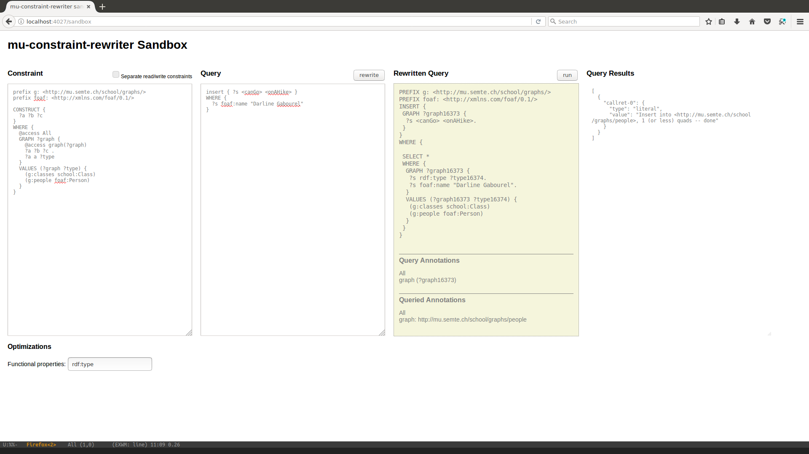

# graph-acl-basics

This is a basis for learning to work with access rights stored in the graphs based on the work of @nathanielrb in https://github.com/nathanielrb/mu-graph-rewriter

## How to

- clone this project
- update ./config/rewriter
- update ./config/resources

Play with the access rights you have defined


### Boot up the system

Boot your microservices-enabled system using docker-compose.

    cd /path/to/graph-acl-basics
    docker-compose up

You can shut down using `docker-compose stop` and remove everything using `docker-compose rm`.

### Sandbox

The sandbox is available at [http://localhost:4027/sandbox](http://localhost:4027/sandbox) and allows testing rewriting logic.

### Annotations

Annotations, prefixed by `@access`, are parsed as quads-level statements. There are two types of annotations, general `@access All` and variable-dependent: `@access Graph(?graph)`.

```
CONSTRUCT {
  ?a ?b ?c
}
WHERE {
  @access All
  GRAPH ?graph { 
    @access Graph(?graph)
    ?a ?b ?c .
    ?a a ?type
  }
  VALUES (?graph ?type) {
    (g:classes school:Class) 
    (g:people foaf:Person) 
  }
}
```

In lieu of better documentation, here's an example of both, in the sandbox. The example is chosen so that the variable `?graph` is not known at rewrite-time, since only the database can say that people have names. If we had specified `?s a foaf:Person` in the query, this annotation could be fully resolved at rewrite-time. (Currently this is partially implemented; the annotation `@access GraphType(?type)` gives the expected results.)



